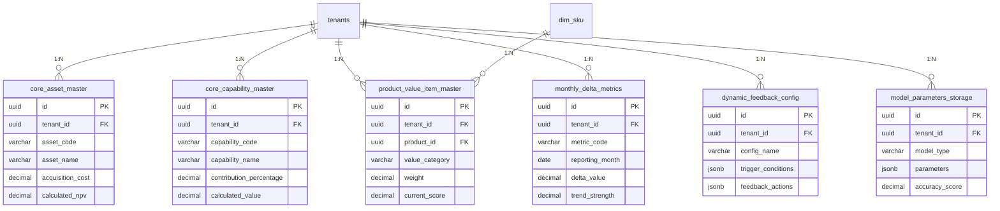

# 边际分析专用数据库Schema设计

## 概述

本文档定义了边际影响分析系统所需的6个专用SQL表，用于支持资产NPV计算、能力价值量化、产品价值评估和全链路增量分析。

## 表结构设计

### 1. 核心资产清单表 (core_asset_master)

```sql
CREATE TABLE core_asset_master (
    id UUID PRIMARY KEY DEFAULT gen_random_uuid(),
    tenant_id UUID NOT NULL REFERENCES tenants(id) ON DELETE CASCADE,
    asset_code VARCHAR(50) NOT NULL,
    asset_name VARCHAR(200) NOT NULL,
    asset_type VARCHAR(50) NOT NULL, -- 'tangible', 'intangible', 'financial'
    acquisition_date DATE NOT NULL,
    acquisition_cost DECIMAL(15,2) NOT NULL,
    useful_life_years INTEGER NOT NULL,
    residual_value DECIMAL(15,2) DEFAULT 0,
    depreciation_method VARCHAR(20) DEFAULT 'straight_line', -- 'straight_line', 'declining_balance', 'sum_of_years'
    current_book_value DECIMAL(15,2),
    status VARCHAR(20) DEFAULT 'active', -- 'active', 'deprecated', 'disposed'
    
    -- NPV计算相关字段
    discount_rate DECIMAL(5,4) DEFAULT 0.10, -- 折现率，默认10%
    cash_flow_years INTEGER DEFAULT 5, -- 现金流预测年数
    annual_cash_flow DECIMAL(15,2)[], -- 未来5年现金流数组
    calculated_npv DECIMAL(15,2), -- 计算得出的NPV
    npv_calculation_date TIMESTAMP,
    
    -- 元数据
    created_at TIMESTAMP WITH TIME ZONE DEFAULT NOW(),
    updated_at TIMESTAMP WITH TIME ZONE DEFAULT NOW(),
    created_by UUID REFERENCES user_profiles(id),
    updated_by UUID REFERENCES user_profiles(id),
    
    -- 约束
    CONSTRAINT unique_asset_code_per_tenant UNIQUE (tenant_id, asset_code),
    CONSTRAINT positive_acquisition_cost CHECK (acquisition_cost > 0),
    CONSTRAINT positive_useful_life CHECK (useful_life_years > 0),
    CONSTRAINT valid_discount_rate CHECK (discount_rate >= 0 AND discount_rate <= 1)
);

-- 索引
CREATE INDEX idx_core_asset_master_tenant_id ON core_asset_master(tenant_id);
CREATE INDEX idx_core_asset_master_asset_type ON core_asset_master(asset_type);
CREATE INDEX idx_core_asset_master_status ON core_asset_master(status);
CREATE INDEX idx_core_asset_master_npv_date ON core_asset_master(npv_calculation_date);

-- RLS策略
ALTER TABLE core_asset_master ENABLE ROW LEVEL SECURITY;
CREATE POLICY tenant_isolation_policy ON core_asset_master
    USING (
        tenant_id = get_user_tenant_id(auth.uid())
        OR has_role(auth.uid(), 'admin')
        OR (has_role(auth.uid(), 'analyst') AND has_cross_tenant_access(auth.uid(), tenant_id))
    );
```

### 2. 核心能力清单表 (core_capability_master)

```sql
CREATE TABLE core_capability_master (
    id UUID PRIMARY KEY DEFAULT gen_random_uuid(),
    tenant_id UUID NOT NULL REFERENCES tenants(id) ON DELETE CASCADE,
    capability_code VARCHAR(50) NOT NULL,
    capability_name VARCHAR(200) NOT NULL,
    capability_type VARCHAR(50) NOT NULL, -- 'technical', 'business', 'management', 'operational'
    capability_level VARCHAR(20) NOT NULL, -- 'beginner', 'intermediate', 'advanced', 'expert'
    description TEXT,
    
    -- 稳定成果量化相关字段
    stable_output_metrics JSONB, -- 稳定成果指标配置
    contribution_percentage DECIMAL(5,4) DEFAULT 0.0, -- 贡献百分比
    annual_benefit DECIMAL(15,2), -- 年度收益
    benefit_measurement_period INTEGER DEFAULT 12, -- 收益测量周期（月）
    last_measurement_date DATE,
    next_measurement_date DATE,
    
    -- 能力价值计算
    calculated_value DECIMAL(15,2), -- 计算得出的能力价值
    value_calculation_date TIMESTAMP,
    value_calculation_method VARCHAR(50), -- 'stable_output', 'contribution_based'
    
    -- 元数据
    created_at TIMESTAMP WITH TIME ZONE DEFAULT NOW(),
    updated_at TIMESTAMP WITH TIME ZONE DEFAULT NOW(),
    created_by UUID REFERENCES user_profiles(id),
    updated_by UUID REFERENCES user_profiles(id),
    
    -- 约束
    CONSTRAINT unique_capability_code_per_tenant UNIQUE (tenant_id, capability_code),
    CONSTRAINT valid_contribution_percentage CHECK (contribution_percentage >= 0 AND contribution_percentage <= 1),
    CONSTRAINT positive_benefit_period CHECK (benefit_measurement_period > 0)
);

-- 索引
CREATE INDEX idx_core_capability_master_tenant_id ON core_capability_master(tenant_id);
CREATE INDEX idx_core_capability_master_type ON core_capability_master(capability_type);
CREATE INDEX idx_core_capability_master_level ON core_capability_master(capability_level);
CREATE INDEX idx_core_capability_master_value_date ON core_capability_master(value_calculation_date);

-- RLS策略
ALTER TABLE core_capability_master ENABLE ROW LEVEL SECURITY;
CREATE POLICY tenant_isolation_policy ON core_capability_master
    USING (
        tenant_id = get_user_tenant_id(auth.uid())
        OR has_role(auth.uid(), 'admin')
        OR (has_role(auth.uid(), 'analyst') AND has_cross_tenant_access(auth.uid(), tenant_id))
    );
```

### 3. 产品价值评估项表 (product_value_item_master)

```sql
CREATE TABLE product_value_item_master (
    id UUID PRIMARY KEY DEFAULT gen_random_uuid(),
    tenant_id UUID NOT NULL REFERENCES tenants(id) ON DELETE CASCADE,
    product_id UUID NOT NULL REFERENCES dim_sku(id),
    value_category VARCHAR(50) NOT NULL, -- 'intrinsic', 'cognitive', 'experiential'
    value_item_name VARCHAR(200) NOT NULL,
    value_item_description TEXT,
    weight DECIMAL(5,4) NOT NULL DEFAULT 0.0, -- 权重
    max_score DECIMAL(5,2) DEFAULT 10.0, -- 最高得分
    evaluation_criteria TEXT, -- 评估标准
    evaluation_method VARCHAR(50), -- 'survey', 'expert_judgment', 'data_analysis'
    
    -- 评估结果
    current_score DECIMAL(5,2), -- 当前得分
    target_score DECIMAL(5,2), -- 目标得分
    score_trend VARCHAR(20), -- 'improving', 'stable', 'declining'
    last_evaluation_date DATE,
    next_evaluation_date DATE,
    
    -- 元数据
    created_at TIMESTAMP WITH TIME ZONE DEFAULT NOW(),
    updated_at TIMESTAMP WITH TIME ZONE DEFAULT NOW(),
    created_by UUID REFERENCES user_profiles(id),
    updated_by UUID REFERENCES user_profiles(id),
    
    -- 约束
    CONSTRAINT unique_value_item_per_product UNIQUE (tenant_id, product_id, value_item_name),
    CONSTRAINT valid_weight CHECK (weight >= 0 AND weight <= 1),
    CONSTRAINT valid_scores CHECK (current_score >= 0 AND current_score <= max_score),
    CONSTRAINT valid_target_score CHECK (target_score >= 0 AND target_score <= max_score)
);

-- 索引
CREATE INDEX idx_product_value_item_tenant_id ON product_value_item_master(tenant_id);
CREATE INDEX idx_product_value_item_product_id ON product_value_item_master(product_id);
CREATE INDEX idx_product_value_item_category ON product_value_item_master(value_category);
CREATE INDEX idx_product_value_item_evaluation_date ON product_value_item_master(last_evaluation_date);

-- RLS策略
ALTER TABLE product_value_item_master ENABLE ROW LEVEL SECURITY;
CREATE POLICY tenant_isolation_policy ON product_value_item_master
    USING (
        tenant_id = get_user_tenant_id(auth.uid())
        OR has_role(auth.uid(), 'admin')
        OR (has_role(auth.uid(), 'analyst') AND has_cross_tenant_access(auth.uid(), tenant_id))
    );
```

### 4. 月度增量指标表 (monthly_delta_metrics)

```sql
CREATE TABLE monthly_delta_metrics (
    id UUID PRIMARY KEY DEFAULT gen_random_uuid(),
    tenant_id UUID NOT NULL REFERENCES tenants(id) ON DELETE CASCADE,
    metric_code VARCHAR(50) NOT NULL,
    metric_name VARCHAR(200) NOT NULL,
    metric_category VARCHAR(50) NOT NULL, -- 'revenue', 'cost', 'efficiency', 'quality', 'customer'
    metric_unit VARCHAR(20), -- 'currency', 'percentage', 'count', 'ratio'
    calculation_method VARCHAR(100), -- 计算方法描述
    
    -- 月度数据
    reporting_month DATE NOT NULL, -- 报告月份（YYYY-MM-01格式）
    current_value DECIMAL(15,4) NOT NULL, -- 当前值
    previous_value DECIMAL(15,4), -- 上月值
    delta_value DECIMAL(15,4), -- 增量值 (current - previous)
    delta_percentage DECIMAL(8,4), -- 增量百分比
    
    -- 趋势分析
    trend_direction VARCHAR(20), -- 'up', 'down', 'stable'
    trend_strength DECIMAL(5,4), -- 趋势强度 (-1 to 1)
    volatility_index DECIMAL(5,4), -- 波动性指数
    
    -- 预测值
    predicted_next_month DECIMAL(15,4), -- 下月预测值
    confidence_level DECIMAL(5,4), -- 预测置信度
    
    -- 元数据
    created_at TIMESTAMP WITH TIME ZONE DEFAULT NOW(),
    updated_at TIMESTAMP WITH TIME ZONE DEFAULT NOW(),
    created_by UUID REFERENCES user_profiles(id),
    
    -- 约束
    CONSTRAINT unique_metric_month_per_tenant UNIQUE (tenant_id, metric_code, reporting_month),
    CONSTRAINT valid_delta_percentage CHECK (delta_percentage >= -100 AND delta_percentage <= 1000),
    CONSTRAINT valid_trend_strength CHECK (trend_strength >= -1 AND trend_strength <= 1),
    CONSTRAINT valid_confidence CHECK (confidence_level >= 0 AND confidence_level <= 1)
);

-- 索引
CREATE INDEX idx_monthly_delta_metrics_tenant_id ON monthly_delta_metrics(tenant_id);
CREATE INDEX idx_monthly_delta_metrics_code ON monthly_delta_metrics(metric_code);
CREATE INDEX idx_monthly_delta_metrics_category ON monthly_delta_metrics(metric_category);
CREATE INDEX idx_monthly_delta_metrics_month ON monthly_delta_metrics(reporting_month);
CREATE INDEX idx_monthly_delta_metrics_trend ON monthly_delta_metrics(trend_direction);

-- RLS策略
ALTER TABLE monthly_delta_metrics ENABLE ROW LEVEL SECURITY;
CREATE POLICY tenant_isolation_policy ON monthly_delta_metrics
    USING (
        tenant_id = get_user_tenant_id(auth.uid())
        OR has_role(auth.uid(), 'admin')
        OR (has_role(auth.uid(), 'analyst') AND has_cross_tenant_access(auth.uid(), tenant_id))
    );
```

### 5. 动态反馈配置表 (dynamic_feedback_config)

```sql
CREATE TABLE dynamic_feedback_config (
    id UUID PRIMARY KEY DEFAULT gen_random_uuid(),
    tenant_id UUID NOT NULL REFERENCES tenants(id) ON DELETE CASCADE,
    config_name VARCHAR(100) NOT NULL,
    config_description TEXT,
    feedback_type VARCHAR(50) NOT NULL, -- 'profit_reinvestment', 'resource_allocation', 'capability_enhancement'
    
    -- 触发条件
    trigger_conditions JSONB NOT NULL, -- 触发条件配置
    threshold_value DECIMAL(15,4), -- 阈值
    comparison_operator VARCHAR(10), -- '>', '<', '>=', '<=', '=', '!='
    evaluation_period INTEGER DEFAULT 1, -- 评估周期（月）
    
    -- 反馈动作
    feedback_actions JSONB NOT NULL, -- 反馈动作配置
    action_priority INTEGER DEFAULT 1, -- 动作优先级
    execution_delay_days INTEGER DEFAULT 0, -- 执行延迟天数
    
    -- 状态控制
    is_active BOOLEAN DEFAULT true,
    last_triggered_date TIMESTAMP,
    next_evaluation_date TIMESTAMP,
    trigger_count INTEGER DEFAULT 0,
    
    -- 元数据
    created_at TIMESTAMP WITH TIME ZONE DEFAULT NOW(),
    updated_at TIMESTAMP WITH TIME ZONE DEFAULT NOW(),
    created_by UUID REFERENCES user_profiles(id),
    updated_by UUID REFERENCES user_profiles(id),
    
    -- 约束
    CONSTRAINT unique_config_name_per_tenant UNIQUE (tenant_id, config_name),
    CONSTRAINT positive_evaluation_period CHECK (evaluation_period > 0),
    CONSTRAINT positive_priority CHECK (action_priority > 0),
    CONSTRAINT non_negative_delay CHECK (execution_delay_days >= 0)
);

-- 索引
CREATE INDEX idx_dynamic_feedback_config_tenant_id ON dynamic_feedback_config(tenant_id);
CREATE INDEX idx_dynamic_feedback_config_type ON dynamic_feedback_config(feedback_type);
CREATE INDEX idx_dynamic_feedback_config_active ON dynamic_feedback_config(is_active);
CREATE INDEX idx_dynamic_feedback_config_next_eval ON dynamic_feedback_config(next_evaluation_date);

-- RLS策略
ALTER TABLE dynamic_feedback_config ENABLE ROW LEVEL SECURITY;
CREATE POLICY tenant_isolation_policy ON dynamic_feedback_config
    USING (
        tenant_id = get_user_tenant_id(auth.uid())
        OR has_role(auth.uid(), 'admin')
        OR (has_role(auth.uid(), 'analyst') AND has_cross_tenant_access(auth.uid(), tenant_id))
    );
```

### 6. 模型参数存储表 (model_parameters_storage)

```sql
CREATE TABLE model_parameters_storage (
    id UUID PRIMARY KEY DEFAULT gen_random_uuid(),
    tenant_id UUID NOT NULL REFERENCES tenants(id) ON DELETE CASCADE,
    model_type VARCHAR(50) NOT NULL, -- 'shapley', 'timeseries', 'npv', 'capability_value'
    model_version VARCHAR(20) NOT NULL, -- 模型版本
    model_name VARCHAR(100) NOT NULL,
    
    -- 参数存储
    parameters JSONB NOT NULL, -- 模型参数
    hyperparameters JSONB, -- 超参数
    feature_importance JSONB, -- 特征重要性
    model_metadata JSONB, -- 模型元数据
    
    -- 性能指标
    accuracy_score DECIMAL(8,6), -- 准确率
    r_squared DECIMAL(8,6), -- R²
    mae DECIMAL(15,6), -- 平均绝对误差
    rmse DECIMAL(15,6), -- 均方根误差
    mape DECIMAL(8,4), -- 平均绝对百分比误差
    
    -- 训练信息
    training_data_size INTEGER, -- 训练数据量
    training_duration_seconds INTEGER, -- 训练时长（秒）
    last_training_date TIMESTAMP,
    next_retraining_date TIMESTAMP,
    
    -- 状态
    model_status VARCHAR(20) DEFAULT 'active', -- 'active', 'deprecated', 'training'
    is_production BOOLEAN DEFAULT false, -- 是否生产环境
    
    -- 元数据
    created_at TIMESTAMP WITH TIME ZONE DEFAULT NOW(),
    updated_at TIMESTAMP WITH TIME ZONE DEFAULT NOW(),
    created_by UUID REFERENCES user_profiles(id),
    
    -- 约束
    CONSTRAINT unique_model_per_tenant UNIQUE (tenant_id, model_type, model_version),
    CONSTRAINT valid_accuracy CHECK (accuracy_score >= 0 AND accuracy_score <= 1),
    CONSTRAINT valid_r_squared CHECK (r_squared >= 0 AND r_squared <= 1),
    CONSTRAINT positive_metrics CHECK (mae >= 0 AND rmse >= 0 AND mape >= 0)
);

-- 索引
CREATE INDEX idx_model_parameters_tenant_id ON model_parameters_storage(tenant_id);
CREATE INDEX idx_model_parameters_type ON model_parameters_storage(model_type);
CREATE INDEX idx_model_parameters_status ON model_parameters_storage(model_status);
CREATE INDEX idx_model_parameters_production ON model_parameters_storage(is_production);
CREATE INDEX idx_model_parameters_training_date ON model_parameters_storage(last_training_date);

-- RLS策略
ALTER TABLE model_parameters_storage ENABLE ROW LEVEL SECURITY;
CREATE POLICY tenant_isolation_policy ON model_parameters_storage
    USING (
        tenant_id = get_user_tenant_id(auth.uid())
        OR has_role(auth.uid(), 'admin')
        OR (has_role(auth.uid(), 'analyst') AND has_cross_tenant_access(auth.uid(), tenant_id))
    );
```

## 表关系图



## 数据迁移脚本

```sql
-- 创建边际分析专用表的迁移脚本
-- 文件名: 20250125000000_create_marginal_analysis_tables.sql

BEGIN;

-- 1. 创建核心资产清单表
CREATE TABLE core_asset_master (
    -- 表结构如上述定义
);

-- 2. 创建核心能力清单表
CREATE TABLE core_capability_master (
    -- 表结构如上述定义
);

-- 3. 创建产品价值评估项表
CREATE TABLE product_value_item_master (
    -- 表结构如上述定义
);

-- 4. 创建月度增量指标表
CREATE TABLE monthly_delta_metrics (
    -- 表结构如上述定义
);

-- 5. 创建动态反馈配置表
CREATE TABLE dynamic_feedback_config (
    -- 表结构如上述定义
);

-- 6. 创建模型参数存储表
CREATE TABLE model_parameters_storage (
    -- 表结构如上述定义
);

-- 创建所有索引
-- (索引创建语句如上述定义)

-- 启用RLS并创建策略
-- (RLS策略如上述定义)

COMMIT;
```

## 使用示例

### 1. 资产NPV计算示例

```sql
-- 插入资产数据
INSERT INTO core_asset_master (
    tenant_id, asset_code, asset_name, asset_type,
    acquisition_date, acquisition_cost, useful_life_years,
    discount_rate, annual_cash_flow
) VALUES (
    'tenant-uuid', 'ASSET-001', '生产设备A', 'tangible',
    '2024-01-01', 1000000.00, 10,
    0.10, ARRAY[120000, 130000, 140000, 150000, 160000]
);

-- 计算NPV
UPDATE core_asset_master 
SET calculated_npv = (
    SELECT SUM(cash_flow / POWER(1 + discount_rate, year_index))
    FROM unnest(annual_cash_flow) WITH ORDINALITY AS t(cash_flow, year_index)
    WHERE year_index <= cash_flow_years
),
npv_calculation_date = NOW()
WHERE id = 'asset-uuid';
```

### 2. 能力价值计算示例

```sql
-- 插入能力数据
INSERT INTO core_capability_master (
    tenant_id, capability_code, capability_name, capability_type,
    contribution_percentage, annual_benefit
) VALUES (
    'tenant-uuid', 'CAP-001', '数据分析能力', 'technical',
    0.25, 500000.00
);

-- 计算能力价值
UPDATE core_capability_master 
SET calculated_value = annual_benefit * contribution_percentage,
value_calculation_date = NOW()
WHERE id = 'capability-uuid';
```

### 3. 月度增量指标示例

```sql
-- 插入月度指标数据
INSERT INTO monthly_delta_metrics (
    tenant_id, metric_code, metric_name, metric_category,
    reporting_month, current_value, previous_value
) VALUES (
    'tenant-uuid', 'REV-001', '月度收入', 'revenue',
    '2024-01-01', 1200000.00, 1100000.00
);

-- 计算增量
UPDATE monthly_delta_metrics 
SET delta_value = current_value - previous_value,
delta_percentage = (current_value - previous_value) / previous_value * 100,
trend_direction = CASE 
    WHEN current_value > previous_value THEN 'up'
    WHEN current_value < previous_value THEN 'down'
    ELSE 'stable'
END
WHERE id = 'metric-uuid';
```

## 性能优化建议

1. **分区策略**: 对`monthly_delta_metrics`表按`reporting_month`进行分区
2. **物化视图**: 创建常用查询的物化视图
3. **缓存策略**: 对计算结果进行缓存
4. **批量操作**: 使用批量插入和更新操作

## 监控和维护

1. **数据质量检查**: 定期检查数据完整性和一致性
2. **性能监控**: 监控查询性能和索引使用情况
3. **备份策略**: 制定数据备份和恢复策略
4. **版本控制**: 对模型参数进行版本控制


